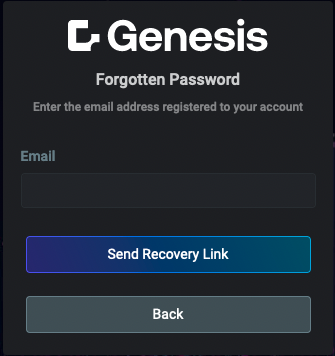
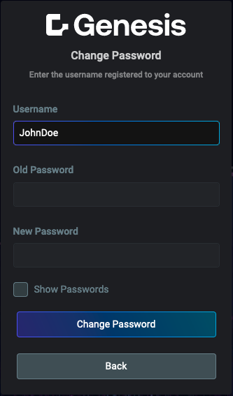
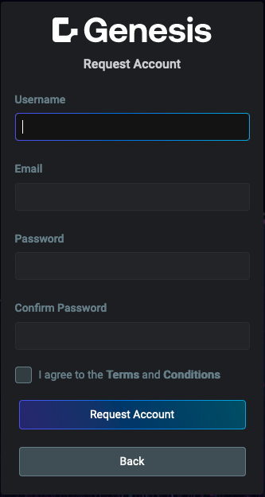

# Foundation Login

[API](./docs/api/index.md)

## Introduction

This micro front-end includes a set of identity management functions, such as authentication (including via SSO) and password reset. Many of the features can be turned on and off as desired, and parts of the login screen (such as the logo) can be customised.

Login uses the [Credential Management API](https://developer.mozilla.org/en-US/docs/Web/API/Credential_Management_API), falling back to cookies when unavailable.

An example of the main login screen: <br/>


An example of authentication via SSO: <br/>


<!-- An example of the forgotten password screen: <br/>
 -->

An example of the change password screen: <br/>


<!-- An example of the request account screen: <br/>
 -->

## Login set-up

:::info
If you build a project upon one of the Genesis seed apps, then the `Login` micro front-end will already be set up for you.
:::

To enable this micro front-end in your application, follow the steps below.

- Add `@genesislcap/foundation-login` as a dependency in your **package.json** file. Whenever you change the dependencies of your project, always run the `$ npm run bootstrap` or `$ npm run bootstrap:ignore-scripts` command again. You can see more information on the [package.json basics](../../../web/basics/package-json-basics/) page.

```javascript
{
  ...
  "dependencies": {
    "@genesislcap/foundation-login": "latest"
  },
  ...
}
```

:::note
This page assumes you're using the routing systems that are part of `foundation-ui`, and will cover set-up as part of that routing system.
:::

Once installed, you can either use `Login` as is or re-configure it. As with all our micro front-ends, you also have the option of lazy loading it.

### Basic usage

[Basic usage example](./docs/api/foundation-login.login.md#example)

### Advanced usage

[Advanced usage example](./docs/api/foundation-login.configure.md#example)

## Public and private routes

You may need to set up a `NavigationContributor` in your application's router config class to handle `public` and `autoAuth` route settings.

- `public`, which indicates that a route doesn't require the user to be authenticated to view it
- `autoAuth`, where, if the user already has an authenticated session, they are automatically logged in again if they navigate away from a page and then return  

```ts
{
    path: 'info',
    element: Info,
    title: 'Info',
    name: 'info',
    settings: { public: true },
},
{
    path: 'admin',
    element: Admin,
    title: 'Admin',
    name: 'admin',
    settings: { autoAuth: true },
}
```

:::caution
By default, a route that isn't marked public is not. However, a non-public route isn't going to block non-authenticated users automatically from viewing them. This must be implemented in a `NavigationContributor`; see [example](./docs/api/foundation-login.login.md#example).
:::

## Authentication

For authentication, most configuration is set in the back end. You should familiarise yourself with the [authentication section of the back-end](../../../server/access-control/introduction).

### Username & password

The standard authentication method is the user supplying their username and password. Even when SSO is enabled as an authentication method, the user will still have the option to sign in with their normal credentials.

:::info
Setting the `DEFAULT_USER` and `DEFAULT_PASSWORD` environment variables automatically populates the credentials in the login form, which can be useful during development so developers don't need to write out their credentials continuously. 

However, the browser could also offer auto-filling if you have previously chosen to save your credentials, which can make setting these unnecessary.
:::

### SSO

SSO functionality allows the `Login` micro front-end to work with your company's existing authentication system, enabling them to have a single set of credentials - including those built on the Genesis low-code platform. Genesis supports SSO with both JWT and SAML.

Setting up SSO is primarily [a back-end task](../../../server/access-control/SSO-jwt); however, there is a small amount of front-end [sso configuration](docs/api/foundation-login.loginconfig.sso.md) required.

:::info
In the standard SSO process, the SSO authentication provider flow is opened via a redirect in the current page. However, many authentication providers block their system when running in an iframe to prevent [clickjacking attacks](https://owasp.org/www-community/attacks/Clickjacking). 

To avoid this, if the Login micro front-end detects that it is running in an iframe, it opens up the authentication provider in a popup.
:::

## Customising login

The `Login` micro front-end can be customised using an exported `configure` function. See [configure](docs/api/foundation-login.configure.md) in the API docs for more information.

## License

Note: this project provides front-end dependencies and uses licensed components listed in the next section; thus, licenses for those components are required during development. Contact [Genesis Global](https://genesis.global/contact-us/) for more details.

### Licensed components
Genesis low-code platform
